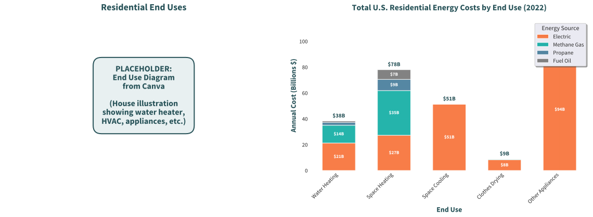

# Website Figure Generation Guide

## Quick Start

1. **Install dependencies:**
   ```bash
   pip install -r requirements.txt
   ```

2. **Generate all figures:**
   ```bash
   python generate_figures.py
   ```

3. **Use in HTML:** (see examples in generate_figures.py output)

---

## Best Image Formats for Web

### 1. **SVG (Recommended for Charts) ⭐**
- **Pros:**
  - Infinitely scalable without quality loss
  - Small file sizes (often 10-50KB)
  - Can be styled with CSS
  - Perfect for line charts, bar charts, graphs
  - Crisp on any screen resolution
- **Cons:**
  - Not suitable for photos
  - Can be slow for very complex graphics

**When to use:** Always use for matplotlib-generated charts and graphs

### 2. **WebP (Modern Format)**
- **Pros:**
  - 25-35% smaller than PNG
  - Supports transparency
  - Excellent compression
  - Supported by all modern browsers
- **Cons:**
  - Limited support in older browsers (IE, old Safari)

**When to use:** As primary format with PNG fallback

### 3. **PNG (Universal Fallback)**
- **Pros:**
  - Universal browser support
  - Lossless compression
  - Supports transparency
- **Cons:**
  - Larger file sizes than WebP
  - Not scalable

**When to use:** As fallback for WebP, or when transparency is needed

### 4. **JPEG (Photos Only)**
- **Pros:**
  - Small file sizes for photos
  - Universal support
- **Cons:**
  - Lossy compression (bad for charts - creates artifacts)
  - No transparency

**When to use:** Only for photographs, NEVER for charts

---

## Recommended Workflow

### For Static Figures (Matplotlib):

```python
# 1. Generate figure with proper styling
fig, ax = plt.subplots(figsize=(10, 6))
# ... create your plot ...

# 2. Save in multiple formats
fig.savefig('assets/my_chart.svg', format='svg', bbox_inches='tight', transparent=True)
fig.savefig('assets/my_chart.webp', format='webp', bbox_inches='tight', dpi=300, quality=90)
fig.savefig('assets/my_chart.png', format='png', bbox_inches='tight', dpi=300)
```

### For Interactive Figures (Plotly):

**Option A: Embed as HTML iframe**
```python
import plotly.graph_objects as go

fig = go.Figure(...)
fig.write_html('assets/interactive_chart.html', include_plotlyjs='cdn')
```
```html
<iframe src="assets/interactive_chart.html" 
        width="100%" height="600px" frameborder="0"></iframe>
```

**Option B: Embed with JavaScript**
```python
fig.write_json('assets/chart_data.json')
```
```html
<div id="myChart"></div>
<script src="https://cdn.plot.ly/plotly-latest.min.js"></script>
<script>
  fetch('assets/chart_data.json')
    .then(response => response.json())
    .then(data => Plotly.newPlot('myChart', data));
</script>
```

**Option C: Export to static image (for thumbnails)**
```python
fig.write_image('assets/chart_thumb.webp', width=800, height=600)
```

---

## HTML Usage Examples

### SVG (Recommended)
```html

```

### WebP with PNG Fallback
```html
<picture>
  <source srcset="assets/budget_impact.webp" type="image/webp">
  
</picture>
```

### Interactive Plotly Chart
```html
<iframe src="assets/interactive_costs.html" 
        width="100%" 
        height="600px" 
        frameborder="0"
        style="border: none;"></iframe>
```

---

## Performance Best Practices

1. **Optimize DPI for web:**
   - Use 72-150 DPI for web display
   - Use 300 DPI only if users need to print

2. **Lazy loading for images:**
   ```html
   
   ```

3. **Responsive images:**
   ```html
   
   ```

4. **Compress images:**
   - SVG: Already small
   - PNG: Use tools like `optipng` or `pngcrush`
   - WebP: Set quality=85-90 for good balance

---

## Interactive vs Static Decision Guide

**Use Static (SVG/PNG):**
- ✅ Page load speed is critical
- ✅ Print-friendly documents
- ✅ Simple charts that don't need interaction
- ✅ Email newsletters

**Use Interactive (Plotly):**
- ✅ Users need to explore data (zoom, hover, filter)
- ✅ Multiple data series to toggle
- ✅ Complex visualizations benefit from interaction
- ✅ Dashboard-style interfaces

**Hybrid Approach (Recommended):**
- Use static SVG thumbnails on main page
- Click to open interactive version in modal/new page
- Best of both worlds: fast load + rich interaction

---

## File Size Guidelines

- **Thumbnail:** < 50KB
- **Full chart:** < 200KB
- **Interactive HTML:** < 500KB (with CDN for Plotly.js)
- **Page total:** Keep all images under 2-3MB for fast load

---

## Color Consistency

Always use the PSE brand colors from the script:
```python
PSE_COLORS = {
    'forest_green': '#275258',
    'orange': '#fb923c',
    'white': '#ffffff',
    'light_blue': '#C4F2EB'
}
```

This matches your frontend design system perfectly!
